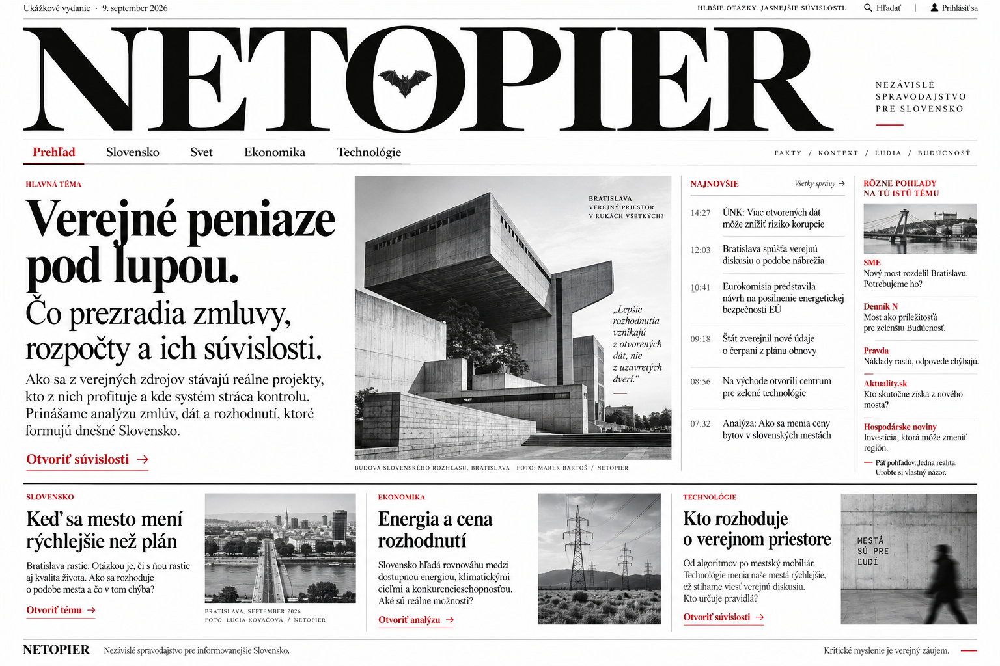

# Netopier — schválený smer frontendu: Vydanie

**Stav: schválený dizajnový smer pre ďalší vývoj.**
Adam vybral prvý obrazový koncept 9. septembra 2026. Dňa 11. septembra 2026
potvrdil, že tento výber má byť zaznamenaný v GitHube ako základ ďalšieho vývoja.

**Frontend Netopiera budeme rozvíjať z návrhu Vydanie zobrazeného nižšie.**
Pôvodná explorácia približne päťdesiatich možností už neurčuje aktuálny rozsah.
Ďalšia práca má rozpracovať tento návrh; zmena hlavného vizuálneho smeru vyžaduje
nové rozhodnutie Adama.

## Schválená vizuálna referencia

[Otvoriť pôvodný obrázok v plnej veľkosti](frontend/design/vydanie-reference.png)

Obrázok je **generovaný koncept dizajnu s ukážkovým obsahom**. Titulky, citácie,
mená autorov, popisy budov a priradenie textov skutočným médiám v obrázku
nepredstavujú overené spravodajstvo. Schválenie sa vzťahuje na vizuálny smer.

## Čo zachovať pri implementácii

- Veľký serifový názov **NETOPIER** cez väčšinu šírky hlavičky; drobný motív
  netopiera v písmene O ako súčasť preskúmania finálnej značky.
- Biely podklad, takmer čierny text, striedme červené akcenty a jemné deliace linky.
- Výraznú serifovú typografiu, rozdiel medzi dominantným titulkom a pokojnejším
  vysvetľujúcim textom, presné zarovnanie a kultivovanú informačnú hustotu.
- Čiernobielu architektonickú fotografiu ako hlavný obrazový prvok.
- Tenkú úžitkovú lištu, samostatný veľký názov a horizontálnu navigáciu rubrík.
- Štyri obsahové pásma titulnej plochy: titulný text, hlavná fotografia,
  najnovšie udalosti s časmi a úzky stĺpec rôznych pohľadov.
- Dolný redakčný pás s tromi menšími tematickými príbehmi a fotografiami.

Obraz má prednosť pred približnými implementačnými hodnotami. Pracovné
kandidáty sú Bodoni Moda pre názov, Newsreader pre redakčný text a Manrope
pre pomocné ovládanie; presné rezy, veľkosti, šírky a odstupy treba overiť
porovnaním vykresleného webu s referenciou. Návrh sa nemá premeniť na bežnú
mriežku zaoblených kariet alebo rozhranie interného dashboardu.

## Čo ďalej rozvinúť

1. Titulnú stránku podľa referencie s funkčnými rubrikami a hľadaním.
2. Detail udalosti: prehľad, chronológia, zdroje a otvorené otázky.
3. Porovnanie pokrytia s jasným pôvodom každej formulácie.
4. Mobilnú kompozíciu zachovávajúcu typografiu, hierarchiu a poradie čítania.

Pri prototype musia byť modelové texty a AI ilustrácie označené. Skutočné médiá
nesmú dostať vymyslené titulky či pokrytie. Budúce živé údaje musia nadviazať na
existujúce v2 kontrakty a zachovať pôvod, čas a rozlíšenie dôkazu od interpretácie.

## Hranica dokončenia

Tento záznam potvrdzuje **výber dizajnu**, nie hotový frontend. V čase záznamu
nie je dokončená ani vizuálne overená webová implementácia; nie je preukázané
napojenie na živé dáta ani nasadenie. Rozpracovaná lokálna kostra nie je súčasťou
tohto záznamu na GitHube.

Implementácia potrebuje porovnanie s referenciou na desktope, overenie mobilného
zobrazenia, čitateľnosti, klávesnicového ovládania a skutočného fungovania
čitateľských interakcií. Vybraný smer zostáva záväzný aj počas týchto kontrol.

## Identifikácia podkladu

- Výber návrhu: 2026-09-09.
- Záznam rozhodnutia pre GitHub: 2026-09-11.
- Referencia: `frontend/design/vydanie-reference.png`, PNG, 1536 × 1024 px.
- SHA-256: `37e517edd8d51b56fa6e37d61e5f98f3706a711e40428ab53bb45131926c6afb`.
- Vstupy: výber prvého obrázka v tejto konverzácii, uložená vizuálna referencia
  a kontrola aktuálnych lokálnych súborov. Staršie alternatívy nie sú schválením
  iného smeru a tento dokument neobnovuje vyradený v0 frontend.
